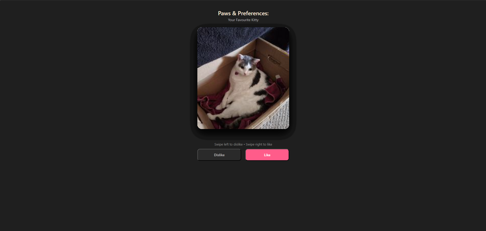
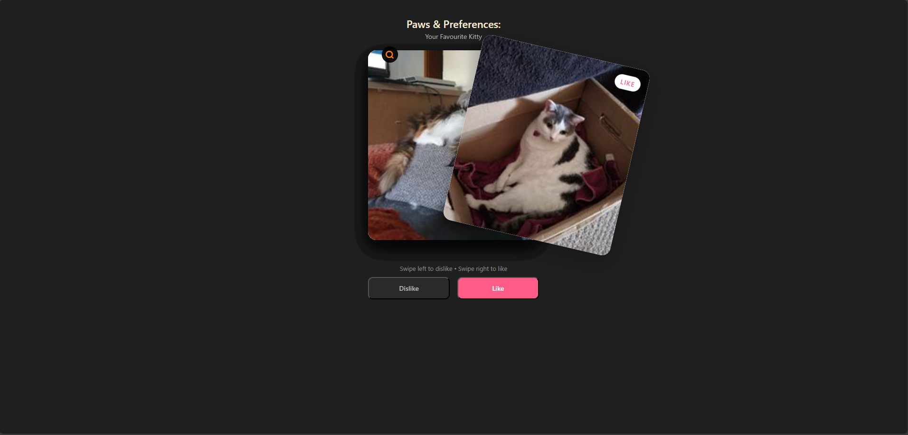

# 🐾 Paws & Preferences

Paws & Preferences is a swipe-based web application that helps users discover their favourite cats.  
Inspired by popular swipe interfaces, users can like or dislike cats and view a summary of their favourites at the end.

The app is built using **HTML, CSS, and JavaScript**, and uses the **Cataas (Cat as a Service) API** to fetch cat images.

---

## 🌐 Live Demo

👉 **Try the app here:**  
https://aimanwafiy.github.io/paws-preferences/

---

## ✨ Features

- Swipe cards left or right using mouse scroll click or touch
- Like / Dislike buttons as an alternative to swiping
- Visual swipe indicators (LIKE / DISLIKE)
- Progress indicator (e.g. `3 / 10`)
- Summary page showing only liked cats
- Click liked images to view a larger version
- Fully responsive and mobile-friendly

---

## 🛠️ Technologies Used

- HTML5
- CSS3
- JavaScript (Vanilla)
- Cataas API (https://cataas.com)

---

## 📸 Screenshots

### Swipe Interface

### Summary View

